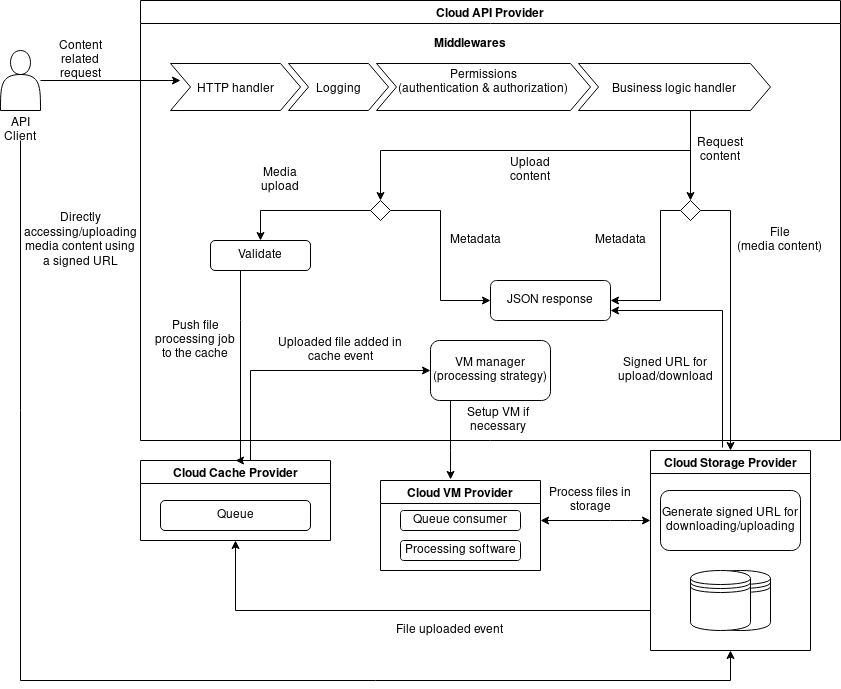

Gami backend API - media content management system
===

This was supposed to be the backend API of [Gami QR & Barcode Scanner], an application designed to provide video and other media content by scanning physical products' labels. For the moment the project is on hold.

## Architecture

The product is based on Google Cloud Platform mostly, but is highly decoupled and it is able to run on any cloud provider that supports NodeJS serverless deployment by implementing a few interfaces for the cross cutting cocerns:
* database - `interface RelationalDatabase` - current available implementations: `GoogleMySQLDatabase`, `SQLiteDatabase`
* file storage - `interface interface Storage` - current available implementations: `GoogleCloudStorageWrapper` 
* key-value cache store - `interface interface KeyValueCache<K, V>` - current available implementations: `InMemoryCacheStore<V>`, `FirestoreCache<V>
* jobs queue - `interface JobsPool<T>` - current available implementations: `FirestoreJobsPool<T>`, `InMemoryJobsPool<T>`
* file processing - `interface Worker` - current available implementations: `GoogleCloudWorker`

Below is a diagram describing the overall business logic flow. The database provider is not included as it is assumed that it should be available at every step of the process. 

